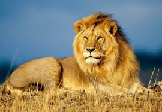
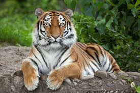
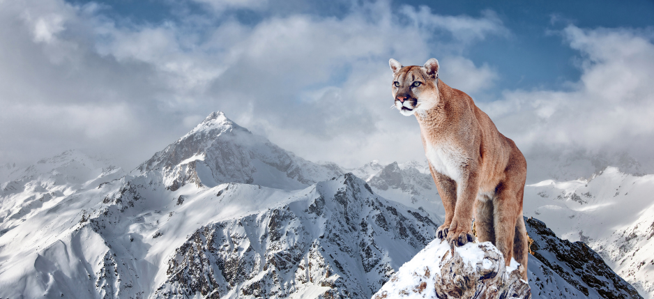
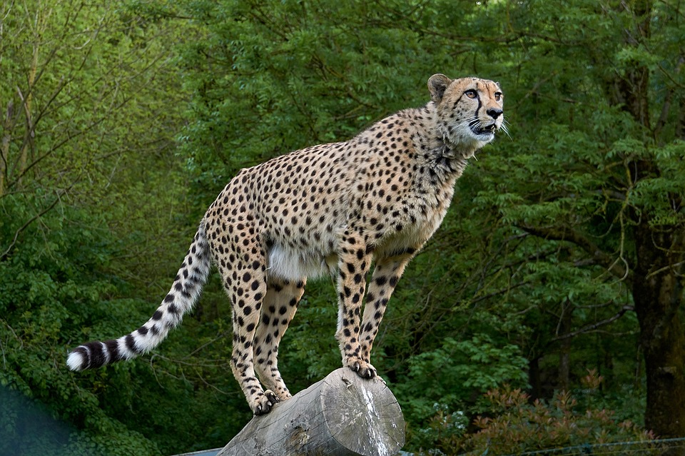

# Katten

Je hebt verschillende soorten katten. Je hebt grote katten, maar je hebt ook huiskatten.

---

## Leeuw

Dit is een **leeuw**.

>hij jaagt in groepen.

---

## Tijger

Dit is een **tijger**.

>hij is de grootste kat

---

## Puma

dit is een **puma**.

>hij wordt ook wel de bergleeuw genoemt

---

## Cheeta

dit is een **cheeta**
