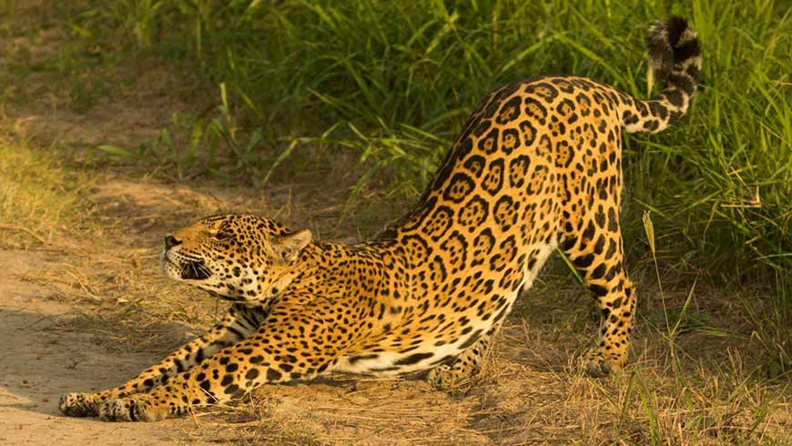

# Katten

Je hebt verschillende soorten katten. Je hebt grote katten, maar je hebt ook huiskatten.

---

## Leeuw

Dit is een **leeuw**.

>Hij jaagt in groepen.

---

## Tijger

Dit is een **tijger**.

>Hij is de grootste kat

---

## Puma

Dit is een **puma**.

>Hij wordt ook wel de bergleeuw genoemt

---

## Cheeta

Dit is een **cheeta**
>Hij is heel snel

---

## Zwarte panter

Dit is een **zwarte panter**
>Als je heel goed kijkt zie je nog de ringen van een luipaard

---

## Luipaard

Dit is een **luipaard**
>De luipaard is het zelfde dier als de panter

---

## Jaguar

Dit is een **jaguar**
>De jaguar heeft ook nog wat geel in zijn ringen

---

Net zag je alle grote katten .Er zijn ook nog huiskatten .Die ga je nu zien.