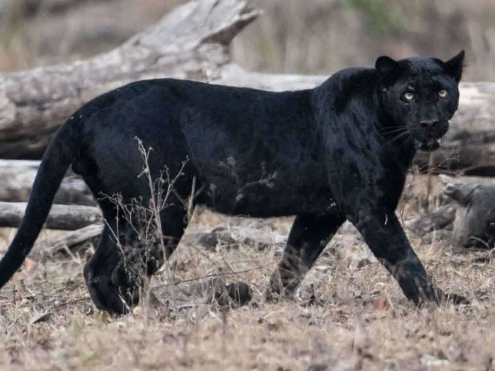
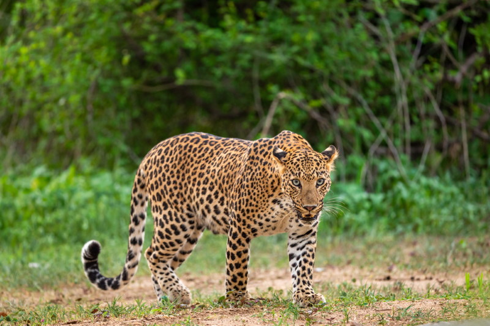

# Katten

Je hebt verschillende soorten katten. Je hebt grote katten, maar je hebt ook huiskatten.

---

## Leeuw

Dit is een **leeuw**.

>hij jaagt in groepen.

---

## Tijger

Dit is een **tijger**.

>hij is de grootste kat

---

## Puma

dit is een **puma**.

>hij wordt ook wel de bergleeuw genoemt

---

## Cheeta

dit is een **cheeta**
>hij is heel snel

---

## zwarte panter

>als je heel goed kijkt zie je nog de ringen van een luipaard
---
## luipaard

>de luipaard is het zelfde dier als de panter
---
